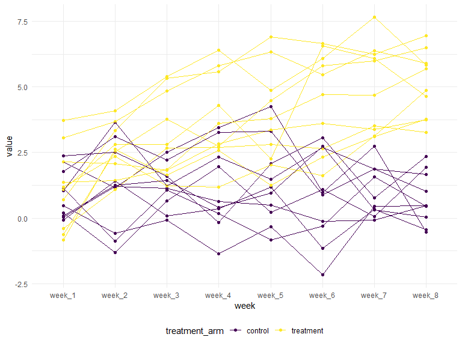

p8105\_hw5\_cs3779
================
CJ Snyder
11/7/2019

# **Problem 1**

## **Uploading Iris Dataset**

``` r
set.seed(10)

iris_with_missing = iris %>% 
  map_df(~replace(.x, sample(1:150, 20), NA)) %>%
  mutate(Species = as.character(Species))

kable(iris_with_missing)
```

| Sepal.Length | Sepal.Width | Petal.Length | Petal.Width | Species    |
| -----------: | ----------: | -----------: | ----------: | :--------- |
|          5.1 |         3.5 |          1.4 |         0.2 | setosa     |
|          4.9 |         3.0 |          1.4 |         0.2 | setosa     |
|          4.7 |         3.2 |          1.3 |         0.2 | setosa     |
|          4.6 |         3.1 |          1.5 |          NA | setosa     |
|          5.0 |         3.6 |          1.4 |         0.2 | setosa     |
|          5.4 |         3.9 |          1.7 |         0.4 | setosa     |
|           NA |         3.4 |          1.4 |         0.3 | setosa     |
|          5.0 |         3.4 |          1.5 |         0.2 | setosa     |
|          4.4 |         2.9 |          1.4 |         0.2 | setosa     |
|          4.9 |         3.1 |           NA |         0.1 | setosa     |
|          5.4 |          NA |          1.5 |         0.2 | setosa     |
|          4.8 |         3.4 |          1.6 |         0.2 | setosa     |
|           NA |          NA |          1.4 |         0.1 | setosa     |
|          4.3 |         3.0 |           NA |         0.1 | setosa     |
|           NA |         4.0 |           NA |         0.2 | setosa     |
|          5.7 |         4.4 |          1.5 |         0.4 | setosa     |
|          5.4 |         3.9 |          1.3 |         0.4 | setosa     |
|          5.1 |         3.5 |          1.4 |          NA | setosa     |
|          5.7 |         3.8 |          1.7 |         0.3 | setosa     |
|          5.1 |         3.8 |          1.5 |          NA | setosa     |
|          5.4 |         3.4 |          1.7 |         0.2 | setosa     |
|          5.1 |         3.7 |          1.5 |         0.4 | NA         |
|          4.6 |         3.6 |          1.0 |         0.2 | setosa     |
|           NA |         3.3 |           NA |         0.5 | setosa     |
|          4.8 |         3.4 |          1.9 |         0.2 | NA         |
|          5.0 |         3.0 |           NA |         0.2 | setosa     |
|          5.0 |         3.4 |          1.6 |         0.4 | NA         |
|          5.2 |         3.5 |          1.5 |         0.2 | setosa     |
|           NA |         3.4 |          1.4 |         0.2 | setosa     |
|          4.7 |         3.2 |          1.6 |         0.2 | setosa     |
|          4.8 |         3.1 |           NA |         0.2 | setosa     |
|          5.4 |          NA |          1.5 |         0.4 | setosa     |
|          5.2 |          NA |          1.5 |         0.1 | setosa     |
|          5.5 |         4.2 |          1.4 |         0.2 | setosa     |
|          4.9 |         3.1 |           NA |         0.2 | setosa     |
|          5.0 |         3.2 |          1.2 |         0.2 | setosa     |
|          5.5 |         3.5 |          1.3 |         0.2 | setosa     |
|          4.9 |         3.6 |          1.4 |         0.1 | setosa     |
|          4.4 |         3.0 |          1.3 |          NA | setosa     |
|          5.1 |         3.4 |          1.5 |         0.2 | setosa     |
|          5.0 |         3.5 |          1.3 |         0.3 | setosa     |
|          4.5 |          NA |          1.3 |          NA | NA         |
|          4.4 |         3.2 |          1.3 |         0.2 | setosa     |
|          5.0 |         3.5 |          1.6 |         0.6 | setosa     |
|          5.1 |         3.8 |          1.9 |         0.4 | setosa     |
|          4.8 |         3.0 |          1.4 |         0.3 | NA         |
|          5.1 |         3.8 |          1.6 |         0.2 | setosa     |
|          4.6 |         3.2 |           NA |         0.2 | setosa     |
|          5.3 |         3.7 |          1.5 |         0.2 | setosa     |
|          5.0 |          NA |          1.4 |         0.2 | setosa     |
|          7.0 |          NA |          4.7 |         1.4 | NA         |
|          6.4 |         3.2 |          4.5 |         1.5 | versicolor |
|          6.9 |         3.1 |          4.9 |         1.5 | versicolor |
|          5.5 |         2.3 |          4.0 |         1.3 | versicolor |
|          6.5 |         2.8 |          4.6 |         1.5 | versicolor |
|          5.7 |         2.8 |          4.5 |         1.3 | versicolor |
|          6.3 |         3.3 |          4.7 |         1.6 | NA         |
|          4.9 |         2.4 |           NA |         1.0 | versicolor |
|          6.6 |         2.9 |          4.6 |         1.3 | NA         |
|          5.2 |         2.7 |          3.9 |         1.4 | versicolor |
|          5.0 |         2.0 |           NA |         1.0 | versicolor |
|          5.9 |         3.0 |          4.2 |         1.5 | versicolor |
|          6.0 |         2.2 |          4.0 |          NA | versicolor |
|          6.1 |         2.9 |          4.7 |         1.4 | versicolor |
|          5.6 |         2.9 |          3.6 |         1.3 | versicolor |
|          6.7 |         3.1 |          4.4 |         1.4 | versicolor |
|          5.6 |         3.0 |          4.5 |         1.5 | versicolor |
|          5.8 |          NA |          4.1 |         1.0 | versicolor |
|          6.2 |         2.2 |          4.5 |         1.5 | versicolor |
|          5.6 |         2.5 |          3.9 |         1.1 | versicolor |
|          5.9 |         3.2 |          4.8 |         1.8 | versicolor |
|           NA |         2.8 |          4.0 |         1.3 | NA         |
|          6.3 |         2.5 |          4.9 |         1.5 | versicolor |
|           NA |         2.8 |           NA |         1.2 | versicolor |
|          6.4 |         2.9 |          4.3 |         1.3 | versicolor |
|          6.6 |         3.0 |          4.4 |         1.4 | versicolor |
|          6.8 |         2.8 |          4.8 |         1.4 | versicolor |
|          6.7 |          NA |          5.0 |          NA | versicolor |
|          6.0 |          NA |          4.5 |          NA | versicolor |
|          5.7 |         2.6 |          3.5 |         1.0 | NA         |
|          5.5 |         2.4 |          3.8 |         1.1 | versicolor |
|           NA |         2.4 |          3.7 |         1.0 | versicolor |
|          5.8 |         2.7 |          3.9 |         1.2 | versicolor |
|          6.0 |         2.7 |          5.1 |         1.6 | versicolor |
|          5.4 |         3.0 |          4.5 |         1.5 | versicolor |
|           NA |         3.4 |          4.5 |         1.6 | versicolor |
|          6.7 |         3.1 |          4.7 |          NA | versicolor |
|           NA |          NA |          4.4 |         1.3 | versicolor |
|          5.6 |         3.0 |           NA |          NA | versicolor |
|          5.5 |         2.5 |          4.0 |          NA | versicolor |
|          5.5 |          NA |          4.4 |         1.2 | versicolor |
|           NA |          NA |          4.6 |          NA | versicolor |
|          5.8 |          NA |          4.0 |          NA | versicolor |
|          5.0 |         2.3 |          3.3 |          NA | NA         |
|           NA |         2.7 |          4.2 |         1.3 | versicolor |
|          5.7 |         3.0 |          4.2 |         1.2 | versicolor |
|          5.7 |         2.9 |          4.2 |         1.3 | versicolor |
|          6.2 |         2.9 |          4.3 |         1.3 | versicolor |
|          5.1 |         2.5 |          3.0 |          NA | versicolor |
|          5.7 |         2.8 |          4.1 |         1.3 | NA         |
|          6.3 |          NA |           NA |         2.5 | virginica  |
|          5.8 |         2.7 |          5.1 |         1.9 | virginica  |
|          7.1 |         3.0 |          5.9 |         2.1 | virginica  |
|          6.3 |         2.9 |          5.6 |         1.8 | virginica  |
|          6.5 |          NA |          5.8 |         2.2 | virginica  |
|          7.6 |         3.0 |          6.6 |         2.1 | virginica  |
|          4.9 |         2.5 |          4.5 |         1.7 | virginica  |
|          7.3 |         2.9 |          6.3 |         1.8 | virginica  |
|          6.7 |          NA |           NA |         1.8 | virginica  |
|           NA |         3.6 |           NA |         2.5 | virginica  |
|          6.5 |         3.2 |          5.1 |         2.0 | virginica  |
|           NA |         2.7 |          5.3 |         1.9 | virginica  |
|          6.8 |         3.0 |          5.5 |         2.1 | NA         |
|          5.7 |          NA |          5.0 |         2.0 | virginica  |
|          5.8 |         2.8 |          5.1 |         2.4 | NA         |
|          6.4 |         3.2 |          5.3 |         2.3 | virginica  |
|          6.5 |         3.0 |           NA |         1.8 | virginica  |
|          7.7 |         3.8 |          6.7 |          NA | NA         |
|          7.7 |         2.6 |          6.9 |         2.3 | NA         |
|          6.0 |         2.2 |          5.0 |         1.5 | virginica  |
|           NA |         3.2 |          5.7 |          NA | virginica  |
|          5.6 |          NA |          4.9 |         2.0 | virginica  |
|          7.7 |         2.8 |          6.7 |         2.0 | virginica  |
|          6.3 |         2.7 |          4.9 |         1.8 | virginica  |
|          6.7 |         3.3 |          5.7 |         2.1 | virginica  |
|          7.2 |         3.2 |          6.0 |         1.8 | virginica  |
|          6.2 |         2.8 |          4.8 |         1.8 | virginica  |
|          6.1 |         3.0 |          4.9 |         1.8 | NA         |
|          6.4 |         2.8 |          5.6 |         2.1 | virginica  |
|          7.2 |         3.0 |          5.8 |         1.6 | virginica  |
|          7.4 |         2.8 |          6.1 |          NA | virginica  |
|          7.9 |         3.8 |           NA |         2.0 | virginica  |
|          6.4 |         2.8 |           NA |         2.2 | virginica  |
|           NA |         2.8 |          5.1 |         1.5 | virginica  |
|          6.1 |          NA |          5.6 |         1.4 | virginica  |
|           NA |         3.0 |          6.1 |         2.3 | virginica  |
|           NA |         3.4 |          5.6 |          NA | NA         |
|          6.4 |         3.1 |          5.5 |          NA | virginica  |
|          6.0 |         3.0 |          4.8 |         1.8 | virginica  |
|          6.9 |         3.1 |          5.4 |         2.1 | virginica  |
|          6.7 |         3.1 |          5.6 |         2.4 | virginica  |
|          6.9 |         3.1 |          5.1 |         2.3 | virginica  |
|           NA |         2.7 |          5.1 |         1.9 | virginica  |
|          6.8 |         3.2 |           NA |         2.3 | virginica  |
|          6.7 |         3.3 |           NA |         2.5 | virginica  |
|          6.7 |         3.0 |          5.2 |         2.3 | virginica  |
|          6.3 |         2.5 |          5.0 |         1.9 | NA         |
|          6.5 |         3.0 |          5.2 |         2.0 | NA         |
|           NA |         3.4 |          5.4 |         2.3 | virginica  |
|          5.9 |         3.0 |          5.1 |         1.8 | virginica  |

## **Creating Function to Replace Missing Values in Iris Dataset**

``` r
replace_missing = function(x) {
  if (is.numeric(x)) {
    x = round(replace_na(x, mean(x, na.rm = TRUE)), digits = 1)
  }
  else if (is.character(x)) {
    (x = replace_na(x, "virginica"))
  }
}

output = vector("list", length = 5)

for (i in 1:5) {
  output[[i]] = replace_missing(iris_with_missing[[i]])
}

iris_with_missing = map_df(.x = iris_with_missing, ~replace_missing(.x))

kable(iris_with_missing)
```

| Sepal.Length | Sepal.Width | Petal.Length | Petal.Width | Species    |
| -----------: | ----------: | -----------: | ----------: | :--------- |
|          5.1 |         3.5 |          1.4 |         0.2 | setosa     |
|          4.9 |         3.0 |          1.4 |         0.2 | setosa     |
|          4.7 |         3.2 |          1.3 |         0.2 | setosa     |
|          4.6 |         3.1 |          1.5 |         1.2 | setosa     |
|          5.0 |         3.6 |          1.4 |         0.2 | setosa     |
|          5.4 |         3.9 |          1.7 |         0.4 | setosa     |
|          5.8 |         3.4 |          1.4 |         0.3 | setosa     |
|          5.0 |         3.4 |          1.5 |         0.2 | setosa     |
|          4.4 |         2.9 |          1.4 |         0.2 | setosa     |
|          4.9 |         3.1 |          3.8 |         0.1 | setosa     |
|          5.4 |         3.1 |          1.5 |         0.2 | setosa     |
|          4.8 |         3.4 |          1.6 |         0.2 | setosa     |
|          5.8 |         3.1 |          1.4 |         0.1 | setosa     |
|          4.3 |         3.0 |          3.8 |         0.1 | setosa     |
|          5.8 |         4.0 |          3.8 |         0.2 | setosa     |
|          5.7 |         4.4 |          1.5 |         0.4 | setosa     |
|          5.4 |         3.9 |          1.3 |         0.4 | setosa     |
|          5.1 |         3.5 |          1.4 |         1.2 | setosa     |
|          5.7 |         3.8 |          1.7 |         0.3 | setosa     |
|          5.1 |         3.8 |          1.5 |         1.2 | setosa     |
|          5.4 |         3.4 |          1.7 |         0.2 | setosa     |
|          5.1 |         3.7 |          1.5 |         0.4 | virginica  |
|          4.6 |         3.6 |          1.0 |         0.2 | setosa     |
|          5.8 |         3.3 |          3.8 |         0.5 | setosa     |
|          4.8 |         3.4 |          1.9 |         0.2 | virginica  |
|          5.0 |         3.0 |          3.8 |         0.2 | setosa     |
|          5.0 |         3.4 |          1.6 |         0.4 | virginica  |
|          5.2 |         3.5 |          1.5 |         0.2 | setosa     |
|          5.8 |         3.4 |          1.4 |         0.2 | setosa     |
|          4.7 |         3.2 |          1.6 |         0.2 | setosa     |
|          4.8 |         3.1 |          3.8 |         0.2 | setosa     |
|          5.4 |         3.1 |          1.5 |         0.4 | setosa     |
|          5.2 |         3.1 |          1.5 |         0.1 | setosa     |
|          5.5 |         4.2 |          1.4 |         0.2 | setosa     |
|          4.9 |         3.1 |          3.8 |         0.2 | setosa     |
|          5.0 |         3.2 |          1.2 |         0.2 | setosa     |
|          5.5 |         3.5 |          1.3 |         0.2 | setosa     |
|          4.9 |         3.6 |          1.4 |         0.1 | setosa     |
|          4.4 |         3.0 |          1.3 |         1.2 | setosa     |
|          5.1 |         3.4 |          1.5 |         0.2 | setosa     |
|          5.0 |         3.5 |          1.3 |         0.3 | setosa     |
|          4.5 |         3.1 |          1.3 |         1.2 | virginica  |
|          4.4 |         3.2 |          1.3 |         0.2 | setosa     |
|          5.0 |         3.5 |          1.6 |         0.6 | setosa     |
|          5.1 |         3.8 |          1.9 |         0.4 | setosa     |
|          4.8 |         3.0 |          1.4 |         0.3 | virginica  |
|          5.1 |         3.8 |          1.6 |         0.2 | setosa     |
|          4.6 |         3.2 |          3.8 |         0.2 | setosa     |
|          5.3 |         3.7 |          1.5 |         0.2 | setosa     |
|          5.0 |         3.1 |          1.4 |         0.2 | setosa     |
|          7.0 |         3.1 |          4.7 |         1.4 | virginica  |
|          6.4 |         3.2 |          4.5 |         1.5 | versicolor |
|          6.9 |         3.1 |          4.9 |         1.5 | versicolor |
|          5.5 |         2.3 |          4.0 |         1.3 | versicolor |
|          6.5 |         2.8 |          4.6 |         1.5 | versicolor |
|          5.7 |         2.8 |          4.5 |         1.3 | versicolor |
|          6.3 |         3.3 |          4.7 |         1.6 | virginica  |
|          4.9 |         2.4 |          3.8 |         1.0 | versicolor |
|          6.6 |         2.9 |          4.6 |         1.3 | virginica  |
|          5.2 |         2.7 |          3.9 |         1.4 | versicolor |
|          5.0 |         2.0 |          3.8 |         1.0 | versicolor |
|          5.9 |         3.0 |          4.2 |         1.5 | versicolor |
|          6.0 |         2.2 |          4.0 |         1.2 | versicolor |
|          6.1 |         2.9 |          4.7 |         1.4 | versicolor |
|          5.6 |         2.9 |          3.6 |         1.3 | versicolor |
|          6.7 |         3.1 |          4.4 |         1.4 | versicolor |
|          5.6 |         3.0 |          4.5 |         1.5 | versicolor |
|          5.8 |         3.1 |          4.1 |         1.0 | versicolor |
|          6.2 |         2.2 |          4.5 |         1.5 | versicolor |
|          5.6 |         2.5 |          3.9 |         1.1 | versicolor |
|          5.9 |         3.2 |          4.8 |         1.8 | versicolor |
|          5.8 |         2.8 |          4.0 |         1.3 | virginica  |
|          6.3 |         2.5 |          4.9 |         1.5 | versicolor |
|          5.8 |         2.8 |          3.8 |         1.2 | versicolor |
|          6.4 |         2.9 |          4.3 |         1.3 | versicolor |
|          6.6 |         3.0 |          4.4 |         1.4 | versicolor |
|          6.8 |         2.8 |          4.8 |         1.4 | versicolor |
|          6.7 |         3.1 |          5.0 |         1.2 | versicolor |
|          6.0 |         3.1 |          4.5 |         1.2 | versicolor |
|          5.7 |         2.6 |          3.5 |         1.0 | virginica  |
|          5.5 |         2.4 |          3.8 |         1.1 | versicolor |
|          5.8 |         2.4 |          3.7 |         1.0 | versicolor |
|          5.8 |         2.7 |          3.9 |         1.2 | versicolor |
|          6.0 |         2.7 |          5.1 |         1.6 | versicolor |
|          5.4 |         3.0 |          4.5 |         1.5 | versicolor |
|          5.8 |         3.4 |          4.5 |         1.6 | versicolor |
|          6.7 |         3.1 |          4.7 |         1.2 | versicolor |
|          5.8 |         3.1 |          4.4 |         1.3 | versicolor |
|          5.6 |         3.0 |          3.8 |         1.2 | versicolor |
|          5.5 |         2.5 |          4.0 |         1.2 | versicolor |
|          5.5 |         3.1 |          4.4 |         1.2 | versicolor |
|          5.8 |         3.1 |          4.6 |         1.2 | versicolor |
|          5.8 |         3.1 |          4.0 |         1.2 | versicolor |
|          5.0 |         2.3 |          3.3 |         1.2 | virginica  |
|          5.8 |         2.7 |          4.2 |         1.3 | versicolor |
|          5.7 |         3.0 |          4.2 |         1.2 | versicolor |
|          5.7 |         2.9 |          4.2 |         1.3 | versicolor |
|          6.2 |         2.9 |          4.3 |         1.3 | versicolor |
|          5.1 |         2.5 |          3.0 |         1.2 | versicolor |
|          5.7 |         2.8 |          4.1 |         1.3 | virginica  |
|          6.3 |         3.1 |          3.8 |         2.5 | virginica  |
|          5.8 |         2.7 |          5.1 |         1.9 | virginica  |
|          7.1 |         3.0 |          5.9 |         2.1 | virginica  |
|          6.3 |         2.9 |          5.6 |         1.8 | virginica  |
|          6.5 |         3.1 |          5.8 |         2.2 | virginica  |
|          7.6 |         3.0 |          6.6 |         2.1 | virginica  |
|          4.9 |         2.5 |          4.5 |         1.7 | virginica  |
|          7.3 |         2.9 |          6.3 |         1.8 | virginica  |
|          6.7 |         3.1 |          3.8 |         1.8 | virginica  |
|          5.8 |         3.6 |          3.8 |         2.5 | virginica  |
|          6.5 |         3.2 |          5.1 |         2.0 | virginica  |
|          5.8 |         2.7 |          5.3 |         1.9 | virginica  |
|          6.8 |         3.0 |          5.5 |         2.1 | virginica  |
|          5.7 |         3.1 |          5.0 |         2.0 | virginica  |
|          5.8 |         2.8 |          5.1 |         2.4 | virginica  |
|          6.4 |         3.2 |          5.3 |         2.3 | virginica  |
|          6.5 |         3.0 |          3.8 |         1.8 | virginica  |
|          7.7 |         3.8 |          6.7 |         1.2 | virginica  |
|          7.7 |         2.6 |          6.9 |         2.3 | virginica  |
|          6.0 |         2.2 |          5.0 |         1.5 | virginica  |
|          5.8 |         3.2 |          5.7 |         1.2 | virginica  |
|          5.6 |         3.1 |          4.9 |         2.0 | virginica  |
|          7.7 |         2.8 |          6.7 |         2.0 | virginica  |
|          6.3 |         2.7 |          4.9 |         1.8 | virginica  |
|          6.7 |         3.3 |          5.7 |         2.1 | virginica  |
|          7.2 |         3.2 |          6.0 |         1.8 | virginica  |
|          6.2 |         2.8 |          4.8 |         1.8 | virginica  |
|          6.1 |         3.0 |          4.9 |         1.8 | virginica  |
|          6.4 |         2.8 |          5.6 |         2.1 | virginica  |
|          7.2 |         3.0 |          5.8 |         1.6 | virginica  |
|          7.4 |         2.8 |          6.1 |         1.2 | virginica  |
|          7.9 |         3.8 |          3.8 |         2.0 | virginica  |
|          6.4 |         2.8 |          3.8 |         2.2 | virginica  |
|          5.8 |         2.8 |          5.1 |         1.5 | virginica  |
|          6.1 |         3.1 |          5.6 |         1.4 | virginica  |
|          5.8 |         3.0 |          6.1 |         2.3 | virginica  |
|          5.8 |         3.4 |          5.6 |         1.2 | virginica  |
|          6.4 |         3.1 |          5.5 |         1.2 | virginica  |
|          6.0 |         3.0 |          4.8 |         1.8 | virginica  |
|          6.9 |         3.1 |          5.4 |         2.1 | virginica  |
|          6.7 |         3.1 |          5.6 |         2.4 | virginica  |
|          6.9 |         3.1 |          5.1 |         2.3 | virginica  |
|          5.8 |         2.7 |          5.1 |         1.9 | virginica  |
|          6.8 |         3.2 |          3.8 |         2.3 | virginica  |
|          6.7 |         3.3 |          3.8 |         2.5 | virginica  |
|          6.7 |         3.0 |          5.2 |         2.3 | virginica  |
|          6.3 |         2.5 |          5.0 |         1.9 | virginica  |
|          6.5 |         3.0 |          5.2 |         2.0 | virginica  |
|          5.8 |         3.4 |          5.4 |         2.3 | virginica  |
|          5.9 |         3.0 |          5.1 |         1.8 | virginica  |

# **Problem 2**

## **Reading in and Tidying Dataset**

``` r
prob2_df = list.files(path = "./data", pattern = "*.csv", full.names = T) %>% 
    map_dfr(~read.csv(.)) %>% 
  mutate(
    treatment_arm = list.files(path="./data") %>% 
              word(sep="_")
  ) %>% 
  rownames_to_column(var = "subject_id") %>%
  mutate(
    treatment_arm = str_replace(treatment_arm, "con", "control"),
    treatment_arm = str_replace(treatment_arm, "exp", "treatment")
  ) %>% 
  select(subject_id, treatment_arm, week_1:week_8) %>%
  pivot_longer(
    cols = starts_with("week"),
    names_to = "week"
  )

prob2_plot = 
  ggplot(prob2_df, aes(x=week, y=value, group=subject_id, color=treatment_arm)) +
  geom_point() + geom_line()

prob2_plot
```



**Notes:** Comparing the treatment arm to the control arm at the
beginning of the observation period, both groups started with around the
same values, but by the end of the 8 week observation period (and
starting around the 3 week period) the treatment arm had on average
higher values than the control arm.

# **Problem 3**
